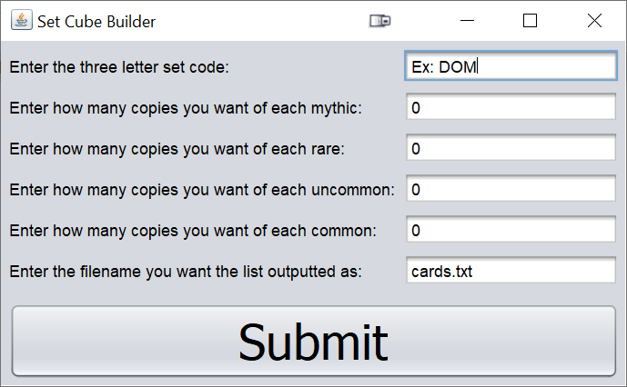

# Set Cube Builder

## What is it

Set Cube Builder is a java application that generates a list of Magic the Gathering cards to be purchased from a given set.

In Magic the Gathering, there is a general format used to import and export lists of cards (decklists). This is used for uploading decklists onto Magic the Gathering: Arena or in this case generating a list of cards to buy from an online retailer. When you have a list of 200+ cards, this saves a lot of time compared to manual entry. This format is a number followed by the card name as seen below.  

```
4 Lightning Bolt
4 Birds of Paradise
```

The Set Cube Builder asks for the set code, what to name the output, and how many cards they want to have of each rarity. It checks for errors then it pulls card data from [Scryfall](https://scryfall.com/) and parses the data with [json-simple](https://code.google.com/archive/p/json-simple/) and other native libraries. It outputs the results formatted like the above example.

## Getting Started

These steps will set you up so that you can run the Set Cube Builder and generate any card lists that you need.

### Prerequisites

You will need an installation of the [Java Runtime Environment](https://www.oracle.com/java/technologies/javase-jdk15-downloads.html).  

### Downloading the Project

You will also need to download the setCubeBuilder.jar file in the [releases page](https://github.com/polyglitch/set-cube-builder/releases/latest). When you run it, it will save the text file wherever you put the jar file, so I recommend putting it somewhere easy to access like your desktop.  

### Running the Project

If everything is set up correctly, you should get a pop up window like the below image when you run setCubeBuilder.jar. After it finishes, there will be a file (whatever you named it) that contains the entire list of cards.  

  


## Development Information

### Built With

[json-simple](https://code.google.com/archive/p/json-simple/) for parsing the JSONs from Scryfall  
[Scryfall](https://scryfall.com/) for the card data  

### Author

**polyglitch** full development - [polyglitch](https://github.com/polyglitch)


### License

This project is licensed under the GNU GPL v3.0 - see the [LICENSE.md](LICENSE.md) file for details

### Acknowledgments

Big thanks to Scryfall for providing an excellent resource to find Magic the Gathering cards. It provides significantly better tools than any other database that is out there while remaining ad-free. 